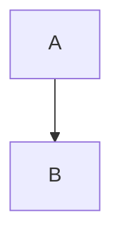
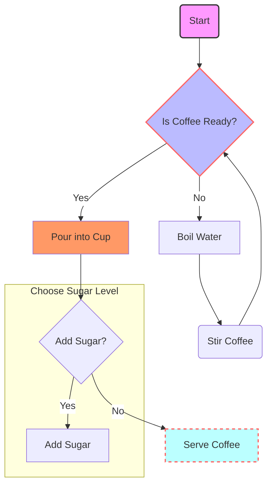
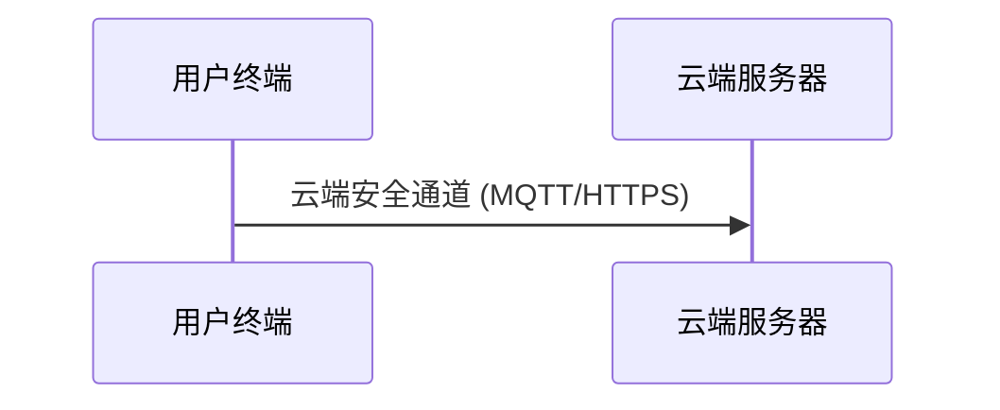
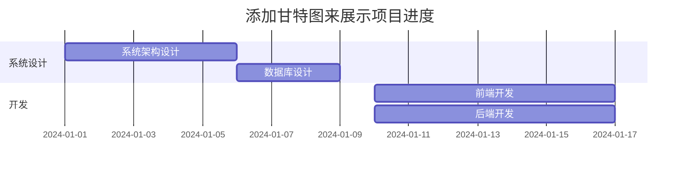
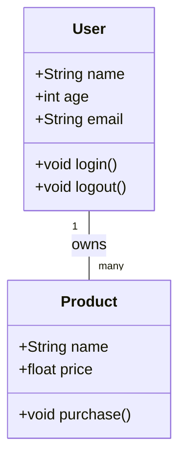

---

Mermaid 是一种基于文本的图表绘制工具，它使用简单的语法来定义图表的结构和样式。以下是 Mermaid 绘图的基本语法和一些常见元素的说明：

### 1. **图类型**

Mermaid 支持多种类型的图表，包括流程图、序列图、甘特图、类图等。每种图表的定义以关键字开始，例如：

- `graph TD`：定义一个自上而下的流程图（Top-Down）。
- `graph LR`：定义一个从左到右的流程图（Left-Right）。
- `sequenceDiagram`：定义一个序列图。
- `gantt`：定义一个甘特图。
- `classDiagram`：定义一个类图。

### 2. **节点和连接**

在流程图中，节点和连接是最基本的元素。

<!-- more -->

#### **节点**

节点可以是文本标签或带有描述的框。例如：

```md
A[用户终端]
B[云端服务器]
```

- `A[用户终端]`：定义一个节点，标签为“用户终端”，节点名称为`A`。
- `B[云端服务器]`：定义一个节点，标签为“云端服务器”，节点名称为`B`。

#### **连接**

连接表示节点之间的关系，使用箭头表示方向。例如：

```js
A-- > B;
```

- `A --> B`：表示从节点`A`到节点`B`的单向连接。
- `A .-> B`：表示从节点`A`到节点`B`的虚线连接。

连接还可以带有描述文本：

```js
A -->|云端安全通道 (MQTT/HTTPS)| B
```

- `|云端安全通道 (MQTT/HTTPS)|`：在连接线上添加描述文本。

### 3. **方向**

流程图的方向可以通过关键字指定：

- `TD`：自上而下（Top-Down）。
- `LR`：从左到右（Left-Right）。
- `RL`：从右到左（Right-Left）。
- `BT`：自下而上（Bottom-Up）。

例如：

```js
graph TD
    A --> B
```



### 4. **分组和子图**

可以使用`subgraph`关键字将多个节点组合在一起，形成一个子图。例如：

```js
subgraph 智能设备组
    C[智能设备1]
    D[智能设备2]
    E[智能设备3]
end
```

- `subgraph 智能设备组`：定义一个子图，标签为“智能设备组”。
- `end`：结束子图的定义。

### 5. **样式和样式类**

可以为节点和连接定义样式。例如：

```js
classDef default fill:#f9f,stroke:#333,stroke-width:2px;
class A,B default;
```

- `classDef default fill:#f9f,stroke:#333,stroke-width:2px;`：定义一个样式类`default`，设置填充颜色为`#f9f`，边框颜色为`#333`，边框宽度为`2px`。
- `class A,B default;`：将样式类`default`应用到节点`A`和`B`。

### 6. **完整示例**

以下是一个完整的 Mermaid 图表示例，展示了如何定义节点、连接、方向、子图和样式：

```js
%%{init: {"theme": "default", "themeVariables": { "primaryColor": "#ffcc00", "edgeLabelBackground":"#ffffff", "tertiaryColor": "#ffccaa"}}}%%
flowchart TB
  %% 定义形状和文本的节点
  A(Start) --> B{Is Coffee Ready?}

  %% 定义带有标签的连接
  B -- No --> C[Boil Water]
  C --> D(Stir Coffee)
  D --> B

  B -- Yes --> E[Pour into Cup]
  E --> F{Add Sugar?}

  %% 子图：糖的选择
  subgraph SUGAR_SELECTION[Choose Sugar Level]
    direction TB
    F -- Yes --> G[Add Sugar]
  end

  F -- No --> H[Serve Coffee]

  %% 定义样式
  style A fill:#f9f,stroke:#333,stroke-width:2px;
  style B fill:#bbf,stroke:#f66,stroke-width:2px;
  style H fill:#bff,stroke:#f66,stroke-width:2px,stroke-dasharray: 5 5

  %% 使用类样式定义
  classDef colorClass fill:#f96;
  class E colorClass;


```



### 7. **其他图表类型**

除了流程图，Mermaid 还支持其他类型的图表，例如：

#### **序列图**

```js
sequenceDiagram
    participant A as 用户终端
    participant B as 云端服务器
    A->>B: 云端安全通道 (MQTT/HTTPS)
```



#### **甘特图**

```js
gantt
    dateFormat  YYYY-MM-DD
    title 添加甘特图来展示项目进度
    section 系统设计
    系统架构设计 :a1, 2024-01-01, 5d
    数据库设计 :a2, 2024-01-06, 3d
    section 开发
    前端开发 :b1, 2024-01-10, 7d
    后端开发 :b2, 2024-01-10, 7d
```



#### **类图**

```js
classDiagram
    class User {
        +String name
        +int age
        +String email
        +void login()
        +void logout()
    }
    class Product {
        +String name
        +float price
        +void purchase()
    }
    User "1" -- "many" Product : owns
```



### 参考文档

- [Mermaid Chart](https://www.mermaidchart.com/app/dashboard) Mermaid 官方在线图表编辑器，提供 AI 图表生成和修复功能。
- [Mermaid Github](https://github.com/mermaid-js/mermaid)
